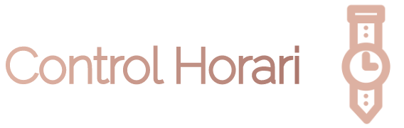

 

# Credits 🧑‍💻
Developed by David González [dgonzalez55](https://github.com/dgonzalez55/)

Latest Release: v0.3.0. January 16, 2023

License: MIT

This product is subject to the terms detailed in the license agreement.

If you have any questions, comments or concerns regarding Control Horari, please consult the documentation prior to contacting one of the developers. Your feedback is always welcome. 

##  Contents 🧰

* About Control Horari
* Installation
* Configuration

## About Control Horari ℹ

Control Horari is just a demo project based in a PHP classroom exercise whose aim is to help showing the basic usage of NIA Framework. Cookie & Hardcoded DB are only used because of the fact that the exercises requires them. The original purpose was to get some practise managing cookies before teaching database access in PHP.

### Features
* Original exercise management (User Hardcoded Data + Cookie DB)
* Improved exercise management (MySQL DB)
* NIA Framework implementation, currently using v0.2.0

## Installation ⚙️

1. Fork/Clone/Download this repo

    `git clone https://github.com/dgonzalez55/ControlHorari.git`

2. Navigate to the directory

    `cd ControlHorari`

3. Download framework dependencies (optional)
 
    `composer update`

## Configuration 🛠

4. Edit config file
    
    `./app/config.php`
  
5. Import MySQL script through phpmyadmin or similar
   
   `./db/controlHorari.sql`